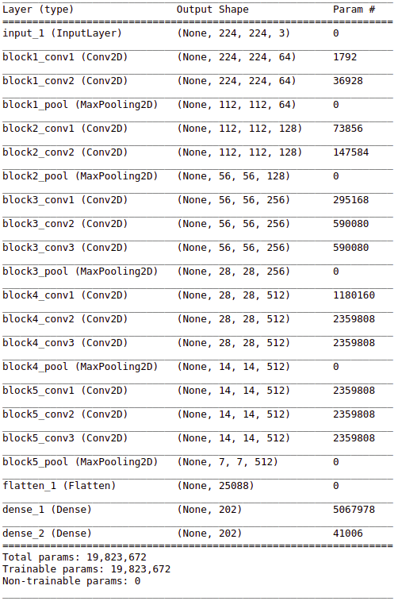
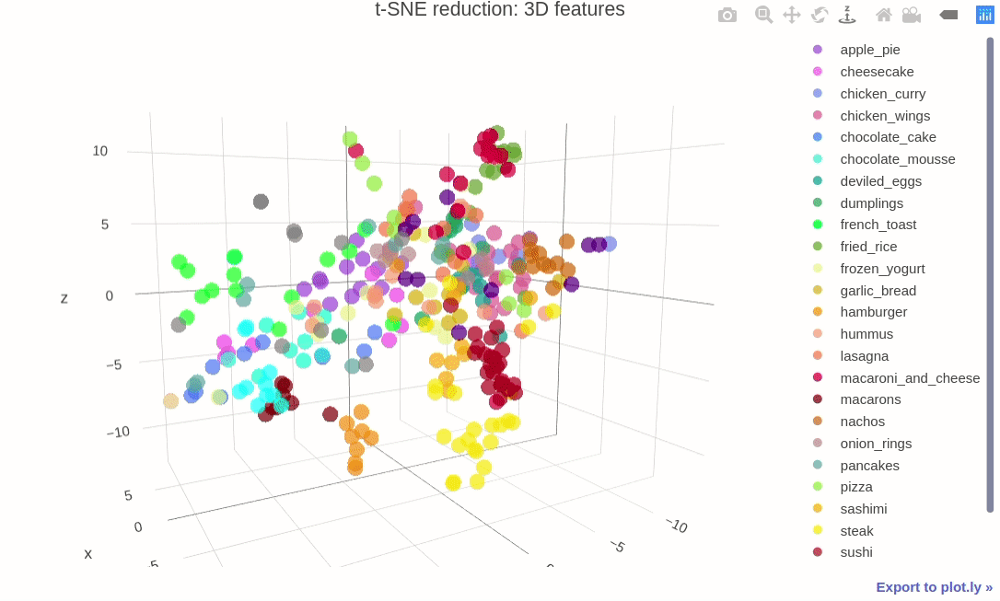
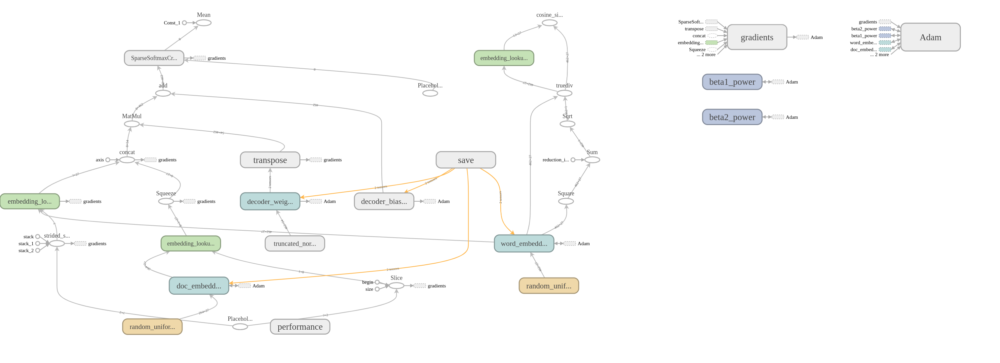
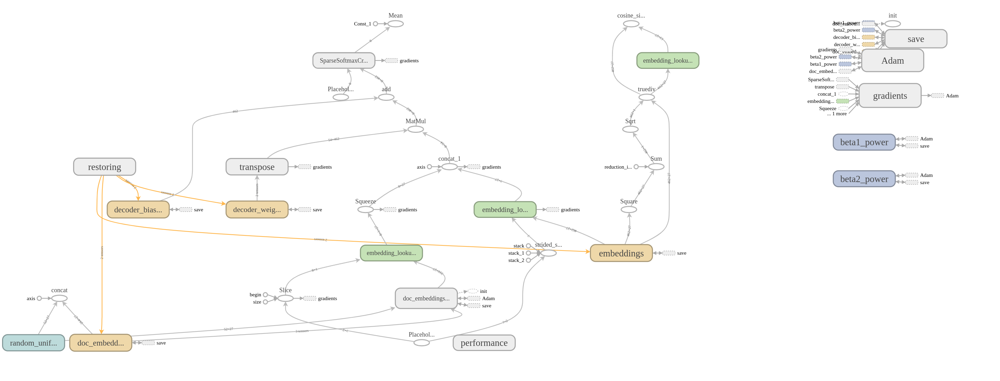
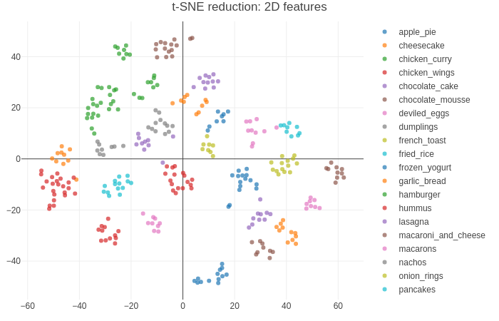
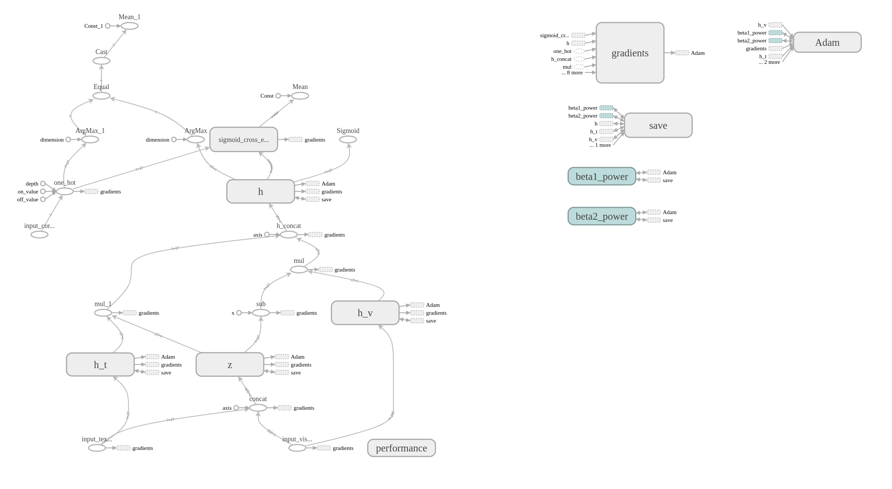
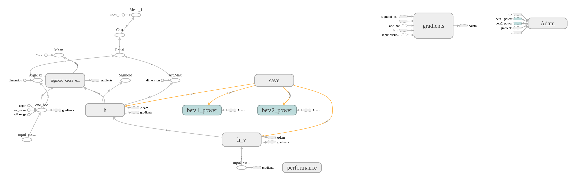

# Multimodal classification

## Introduction

The classification task of the real-world multimedia data can be sufficiently complex for a single machine learning model. One of the possible ways to achive more precise results lies in the using of the multiple models to process multiple modalities (e.g. visual modality and textual modality) of the same datasource.  
The goal of the project is to show the performance of the multimodal classification approach on the common real-world dataset.  
The introduced multimodal classification method is based on using of the 3 neural networks:
- The first neural network extracts features from the visual modality
- The second neural network extracts features from the textual modality
- The third neural network decides which of 2 modalities is more informative one and then performs the classification with paying more attention to the more informative modality and less attention to the less informative modality  

## Dataset

Dataset consits of 316 cooking recipes collected from the internet portals. The photos of the cooked meal represent the visual modality (input to the first neural network) and the text of recipe (ingredients and cooking method) is the textual modality (input to the second neural network).  
Collected dataset is complex enough: dataset consists of 27 food categories. Some of categories were choosen such that the repices are sufficiently similar (for example, sashimi and sushi have some common ingredients; cooked meals looks similarly).  Some recipes are long and detailed, contain multiple photos of the meal, while another recipes are very short.   

##  Image feature extraction

### Neural network architecture:
CNN consiting of the 13 convilutional layers, 5 max pulling layers and 2 dense layers extracts feature vector of length 202 from each image. In case that the recipe has multiple images, neural network extracts feature vector from each image, then the mean value of all obtained vectors is computed.  

###  Extracted features visualization:

### - [t-SNE 3D](https://plot.ly/~xkaple01/185)

## Text features extraction
Feature extraction from the recipe text is performed in unsupervised manner via doc2vec neural network architecture adopted for our task. Obtained feature vectors of the recipes belonging to the same category are more similar than the feature vectors of recipes belonging to the different categories. The length of the feature vector is 27 (equal to the number of food categories)  
  
### Doc2vec architecture: Tensorflow implementation  
Both of classical doc2vec architectures (DM and DBOW) were implemented and tested, then the resulting neural network was obtained by such doc2vec modification that brings the best performance on our dataset.  
  
Training phase architecture:    
  
  
  
Inference phase architecture:    
  
  
  
Feature vectors obtained during the training and the inference phases:  

  
  
  
### Nearest vectors to specified words:
  

  
  
  

## Multimodal classification - Gaited Multimodal Unit:
Consider the following scenarios:  
- the text of the recipe is very detailed, but the photo of the meal is taken at the wrong angle:  
in this case the recipe can be successfully classified based on the textual modality
- the recipe is too exotic, but the meal on the photo doesn't differs too much from the other meals of its category:
in this case the recipe can be successfully classified based on the visual modality  

The task of the gaited multimodal unit is to estimate how informative is the visual modality and how informative is the textual modality of the given recipe. More informative modality is more important for the final classification performed by the GMU.  
 

### Adopted GMU architecture: Tensorflow implementation  
  
  
 

### Performance contribution of the multimodal classification approach
To estimate the contribution of the multiple modalities usage for the classification task, the single modal classification (e.g. based only on images or based only on texts) was performed at first.  
The usage of the only one modality means that GMU degrades to the 2-layer artificial neural network as shown at the next picture:  
  
   

  
### Crossvalidation  
The performance of all neural networks was examined using the crossvalidation. In each of 10 crossvalidation iterations the available dataset was splitted into the training dataset and the validation dataset, such that the validation dataset consists of the 20% randomly choosen recipes from each food category (validation: 52 recipes, training: 264 recipes)  
  
Note: all graphs below represent one of the crossvalidation iterations
  
### Single modal classification:
### - visual modality only   
  
  
### - textual modality only  
  
  
The mean value of classification accuracy is 77% for the visual modality and 93% for the textual modality.  
  
### Multimodal classification  
  
  
The multimodal classification accuracy obtained in each iteration of the crossvalidation lies in the interval 94% - 100%.  

### Mean crossovalidation accuracy of the introduced multimodal classification approach is 97% 
